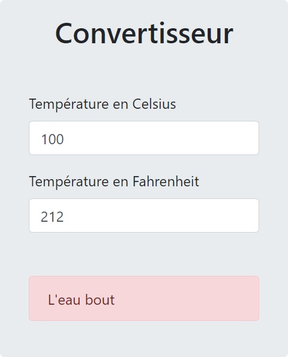

### A temperature converter: celsius / fahrenheit

# Getting Started with Create React App

This project was bootstrapped with [Create React App](https://github.com/facebook/create-react-app).

How to start the project : 

- Download the project
- Use Npm install
- Use Npm start or yarn start

### `npm start`

Runs the app in the development mode.\
Open [http://localhost:3000](http://localhost:3000) to view it in the browser.

The page will reload if you make edits.\
You will also see any lint errors in the console.

